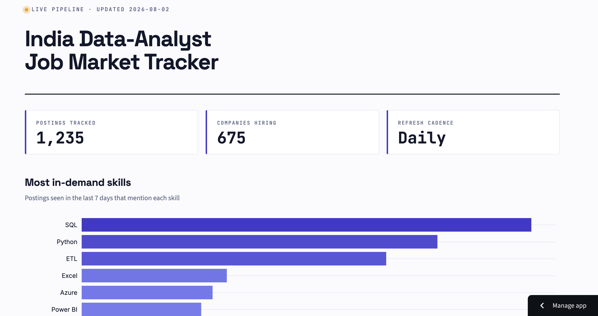
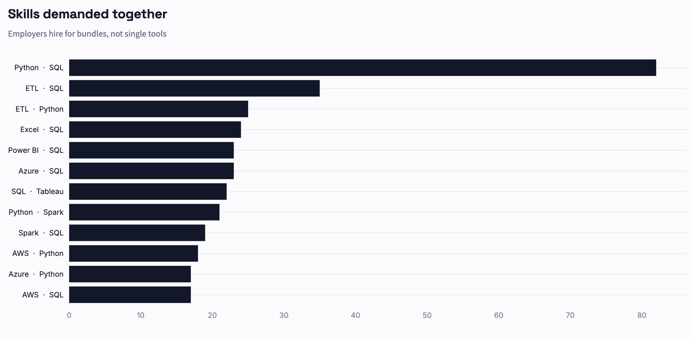
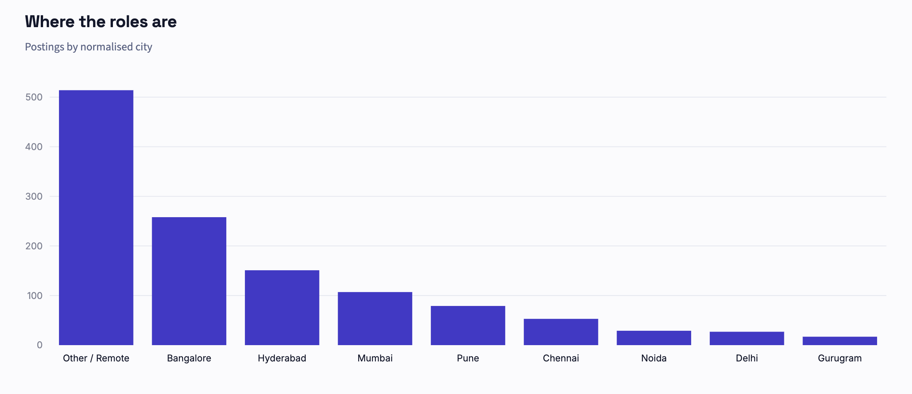
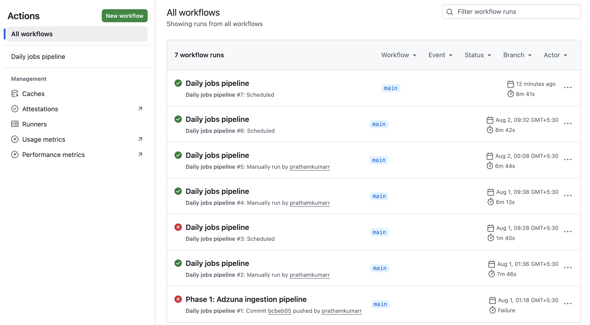
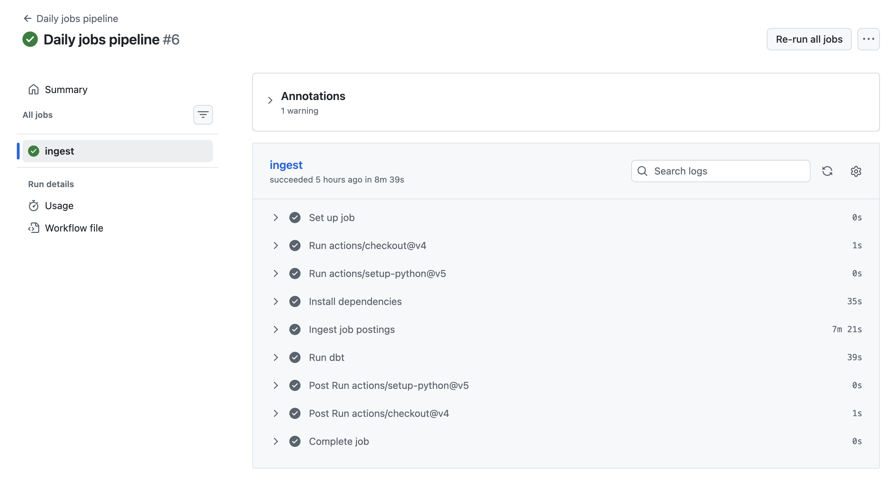

# India Data-Analyst Job Market Tracker

**A live data pipeline that collects Indian data-analyst job postings every morning, tracks how they change over time, and publishes the findings to a public dashboard.**

**[View the live dashboard →](https://india-data-jobs-tracker.streamlit.app)**



<details>
<summary>More views</summary>





</details>

---

## Why this exists

Most job-market analysis works from a dataset someone else already collected and froze in time. That makes some questions permanently unanswerable: *How long does a posting actually stay open? Which roles get reposted month after month? Is hiring accelerating or cooling right now?*

Those questions need **repeated observations of the same market**, so this project generates them. Every morning at 06:00 IST, a GitHub Actions job pulls current postings from the Adzuna API, records which postings it saw and when, and rebuilds the analytics layer. The dataset doesn't exist anywhere else, and it grows every day.

---

## Findings

*Figures below are from 2 August 2026 — the live dashboard always shows current numbers.*

**1,234 postings tracked across 675 companies.**

### SQL and Python are the market, not the BI tool

| Skill | Postings | Share of live postings |
|---|---:|---:|
| SQL | 156 | 12.9% |
| Python | 123 | 10.2% |
| ETL | 106 | 8.8% |
| Excel | 49 | 4.1% |
| Azure | 45 | 3.7% |
| Power BI | 42 | 3.5% |

The BI-tool debate that dominates job-seeker forums — Power BI or Tableau? — turns out to be a rounding error. Power BI appears in 3.5% of postings; SQL appears in nearly four times as many. For anyone deciding what to learn next, the data is unambiguous about where the leverage is.

### Employers hire for bundles, not single tools

| Skill pair | Postings requiring both |
|---|---:|
| Python + SQL | 80 |
| ETL + SQL | 35 |
| ETL + Python | 25 |
| Excel + SQL | 23 |
| Azure + SQL | 23 |
| Power BI + SQL | 23 |

Python + SQL co-occur more than twice as often as the next pair. Notably, **every** top pairing includes SQL — it behaves less like a competing skill and more like the substrate everything else sits on.

### Hiring is more distributed than "the NCR vs Bangalore" framing suggests

| City | Postings |
|---|---:|
| Other / Remote | 501 |
| Bangalore | 255 |
| Hyderabad | 149 |
| Mumbai | 103 |
| Pune | 78 |
| Chennai | 52 |

The largest single bucket is *Other / Remote* — more postings than Bangalore and Hyderabad combined. Metro-only job searches miss a substantial share of the market.

### Posting longevity — accumulating

Measuring how long a posting stays live requires observing the same posting across many days. With daily collection now running, this becomes meaningful at roughly 30 days of history and is tracked on the live dashboard. It's the finding this architecture was designed to make possible.

---

## Architecture

```
                 ┌──────────────────────────────────────────────┐
                 │      GitHub Actions · cron 06:00 IST         │
                 │                                              │
   Adzuna API ──►│  1. ingest.py  → upsert raw_jobs             │
   (India)       │                  append daily_snapshots      │
                 │  2. dbt build  → staging → marts + tests     │
                 └──────────────────────┬───────────────────────┘
                                        │
                                        ▼
                         ┌────────────────────────────┐
                         │   Supabase Postgres        │
                         │   public.*    raw layer    │
                         │   analytics.* dbt models   │
                         └──────────────┬─────────────┘
                                        │ cached reads
                                        ▼
                         ┌────────────────────────────┐
                         │   Streamlit Community Cloud│
                         └────────────────────────────┘
```

**Ingest → store → transform → test → serve.** Every layer runs on free infrastructure with no manual intervention.

---

## The design decision that makes this work

Two tables carry the whole idea:

**`raw_jobs`** — one row per unique posting, keyed on Adzuna's posting ID, carrying `first_seen_date` and `last_seen_date`. Re-running the pipeline never duplicates a row; it advances `last_seen_date` via an `ON CONFLICT` upsert. The pipeline is **idempotent** — running it twice in a day produces the same result as running it once.

**`daily_snapshots`** — an append-only log of every `(job_id, date)` pair observed. This is the time dimension. Posting longevity, repost detection, and market velocity are all reconstructed from it, and none of them can be derived from a single-point-in-time dataset.

That distinction — a snapshot log rather than a current-state table — is the difference between a dataset you can download and one you have to build.

---

## Stack

| Layer | Tool | Why |
|---|---|---|
| Source | Adzuna API | Official API with India coverage; no ToS violation, unlike scraping job boards |
| Orchestration | GitHub Actions | Free cron on public repos; no server to maintain |
| Storage | Supabase Postgres | Managed Postgres, free tier; daily writes prevent the 7-day inactivity pause |
| Transformation | dbt-core | Version-controlled SQL models with built-in data testing |
| Serving | Streamlit Community Cloud | Live database connection — a static BI export can't show today's numbers |

### Reliability

The pipeline failed on its first scheduled run: Adzuna returned a `503` on one page, and a single failed HTTP call aborted the entire day's collection. Ingestion now retries with exponential backoff and degrades gracefully — if a page fails after three attempts it's logged and skipped, so one bad response costs 50 postings instead of a full day.


*Run #3 failed on a third-party 503. Runs #4 onward are green after adding retry logic.*


*A single scheduled run — ingestion, dbt models, and all six data tests.*

### Data quality

`dbt build` runs six tests on every pipeline execution — uniqueness and not-null on primary keys, and an `accepted_values` test on the normalised city column. A schema change or bad upstream data **fails the build** rather than silently propagating to the dashboard.

Skill extraction uses word-boundary regex (`~* '\yword\y'`) rather than substring matching. A naive `LIKE '%r%'` would match "R" inside every word in every description, and "SAS" inside "sass" — the kind of silent error that produces confident, wrong numbers.

---

## Limitations

Stated plainly, because they affect how the findings should be read:

- **Adzuna is a sample, not a census.** It aggregates from many sources but doesn't cover the entire Indian market. Treat proportions as directional, not absolute.
- **Descriptions are snippets, not full job descriptions.** Skill detection undercounts, because a posting may require SQL without the snippet mentioning it. Percentages are a floor, not a true rate.
- **Salary data is sparse.** Most Indian postings omit compensation, so salary analysis covers only the subset that reports it.
- **Longevity metrics need history.** They become reliable at roughly 30 days of daily collection and improve from there.
- **Reposts under a new posting ID appear as new postings.** Near-duplicate detection (same title, company, and city) is a planned addition.

---

## Repository

```
├── ingestion/
│   ├── config.py         search terms, pagination
│   ├── db.py             connection builder
│   └── ingest.py         fetch, retry, upsert, snapshot
├── dbt_project/
│   ├── models/
│   │   ├── staging/      stg_jobs — cleaning, city normalisation, days_live
│   │   ├── intermediate/ int_job_skills — word-boundary skill extraction
│   │   └── marts/        skill demand · co-occurrence · longevity · velocity
│   └── seeds/            skill_dictionary.csv
├── dashboard/            Streamlit app
├── sql/schema.sql        raw-layer DDL
└── .github/workflows/    daily cron
```

---

## Running it locally

```bash
git clone https://github.com/prathamkumarr/India-data-jobs-tracker.git
cd India-data-jobs-tracker

python3.12 -m venv .venv
source .venv/bin/activate
pip install -r requirements.txt

cp .env.example .env      # add Adzuna keys + Postgres credentials
psql "$DATABASE_URL" -f sql/schema.sql

cd ingestion && python3 ingest.py
cd ../dbt_project && dbt seed && dbt build
cd .. && streamlit run dashboard/streamlit_app.py
```

Requires a free [Adzuna API key](https://developer.adzuna.com/) and a Postgres database.

---

## Author

**Pratham Kumar** — Data Analyst

[GitHub](https://github.com/prathamkumarr) · [LinkedIn](https://www.linkedin.com/in/pratham-kumar-13b712319) · prathamkumar736@gmail.com